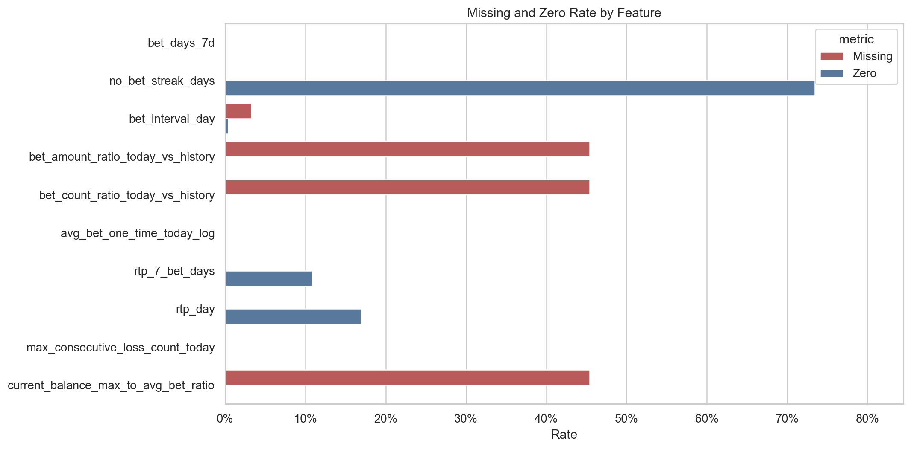
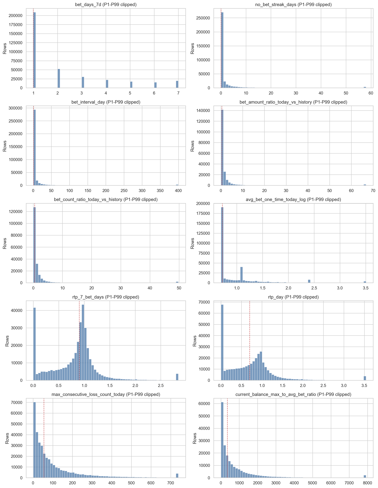
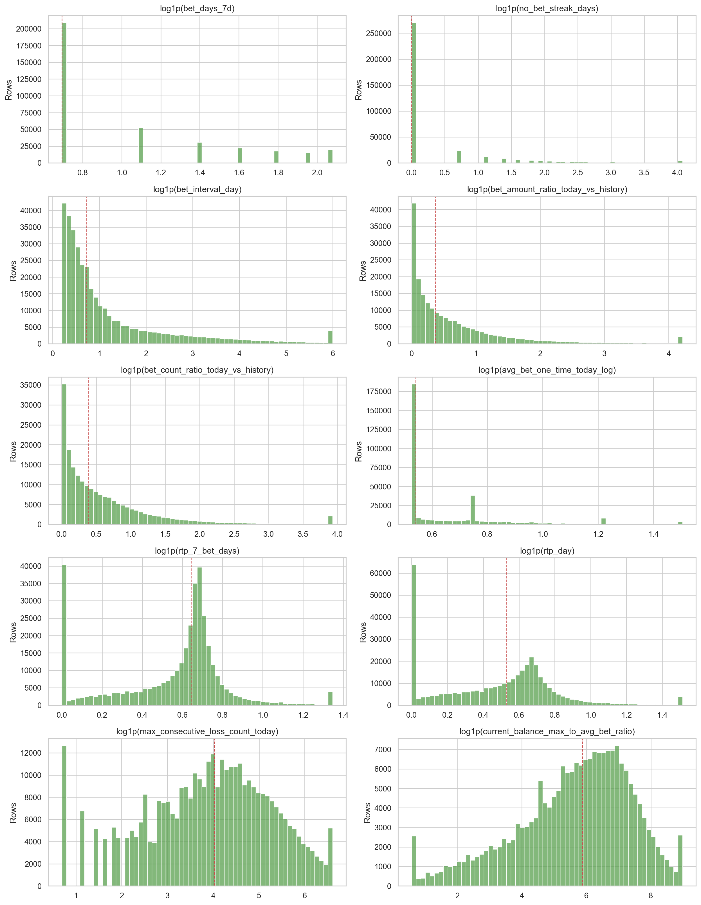
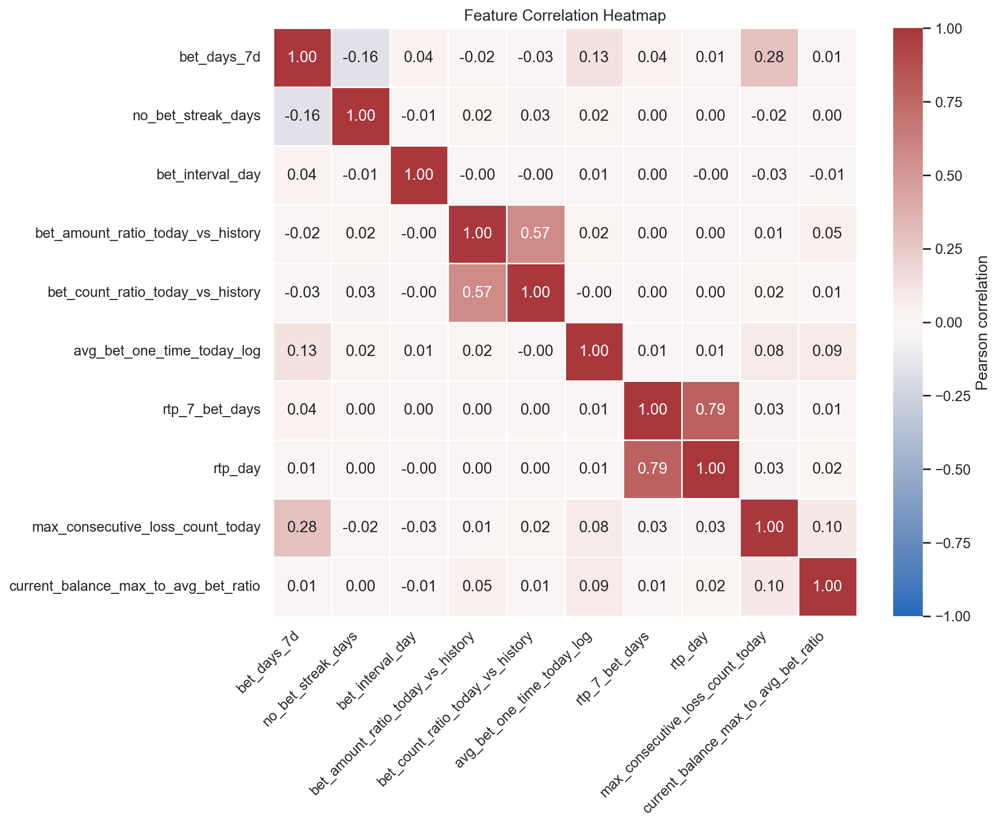
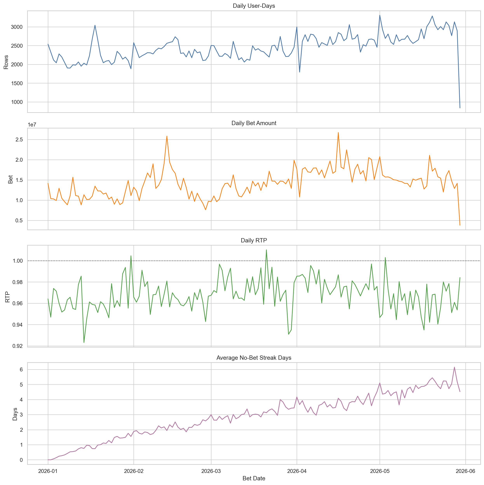
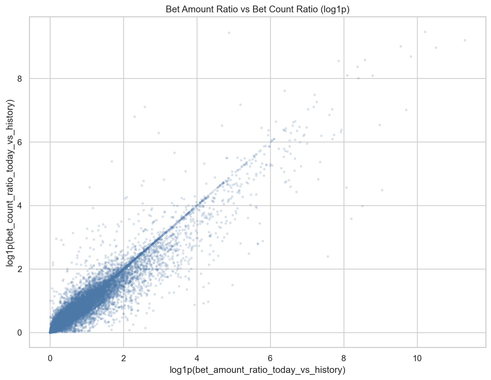
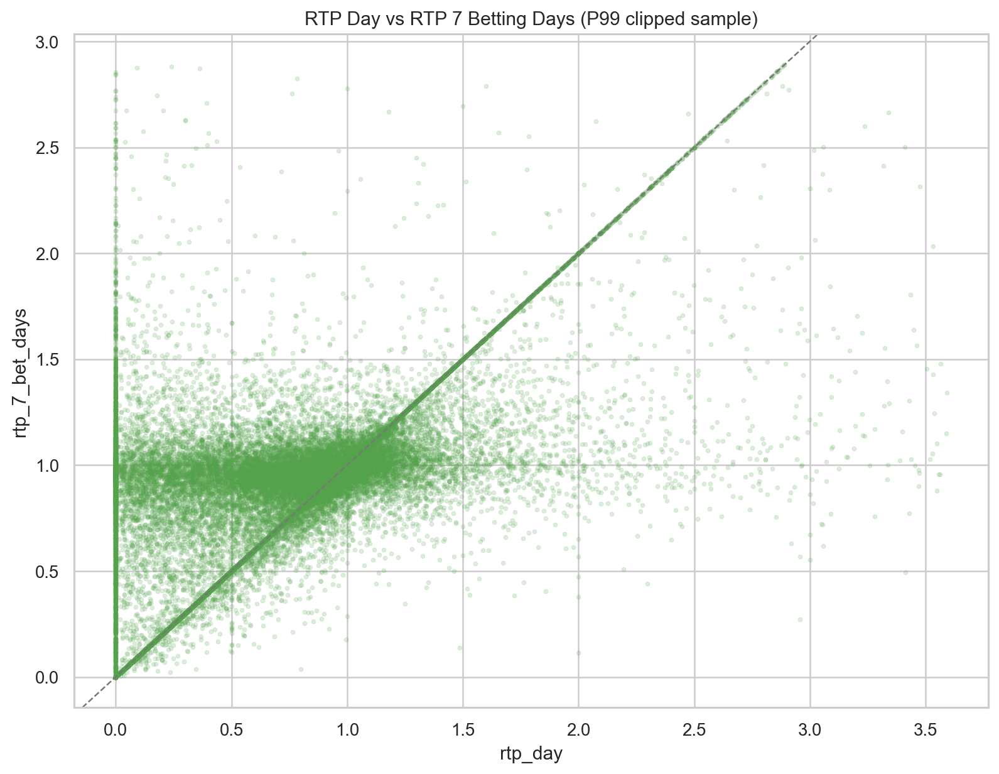
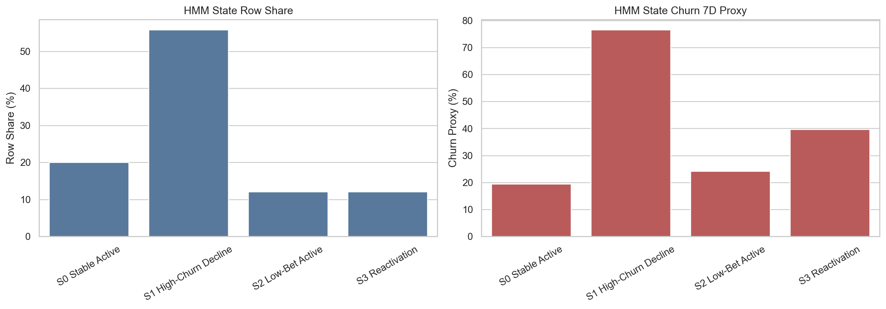

# HMM Feature EDA

## Dataset

- Rows: `368,333` user-days
- Users: `167,265`
- Date range: `2026-01-01 00:00:00` to `2026-05-30 00:00:00`

## Feature Summary

| Feature | Missing | Zero | Mean | P50 | P95 | P99 | Max | Skew |
|---|---:|---:|---:|---:|---:|---:|---:|---:|
| bet_days_7d | 0.00% | 0.00% | 2.2213 | 1.0000 | 7.0000 | 7.0000 | 7.0000 | 1.4205 |
| no_bet_streak_days | 0.00% | 73.44% | 3.0331 | 0.0000 | 17.0000 | 58.0000 | 148.0000 | 6.0862 |
| bet_interval_day | 3.26% | 0.37% | 29.1861 | 1.0403 | 52.2407 | 399.8175 | 84,593.0000 | 83.5565 |
| bet_amount_ratio_today_vs_history | 45.41% | 0.00% | 11.4206 | 0.4437 | 8.3171 | 66.7177 | 141,450.0000 | 163.8925 |
| bet_count_ratio_today_vs_history | 45.41% | 0.00% | 6.4537 | 0.4758 | 6.7852 | 49.7630 | 27,910.0000 | 89.9922 |
| avg_bet_one_time_today_log | 0.00% | 0.00% | 1.0193 | 0.7191 | 2.3949 | 3.5034 | 6.9088 | 3.0133 |
| rtp_7_bet_days | 0.00% | 10.83% | 0.8492 | 0.9014 | 1.4358 | 2.8451 | 700.0000 | 159.4248 |
| rtp_day | 0.00% | 16.96% | 0.7636 | 0.7006 | 1.5971 | 3.5403 | 700.0000 | 111.6661 |
| max_consecutive_loss_count_today | 0.00% | 0.13% | 109.5234 | 55.0000 | 413.0000 | 739.0000 | 3,066.0000 | 3.1666 |
| current_balance_max_to_avg_bet_ratio | 45.41% | 0.10% | 936.7889 | 353.5055 | 3,261.6155 | 7,911.7640 | 2,254,658.9200 | 266.8443 |

## Top Absolute Correlations

| Feature A | Feature B | Pearson Corr |
|---|---|---:|
| rtp_7_bet_days | rtp_day | 0.7860 |
| bet_amount_ratio_today_vs_history | bet_count_ratio_today_vs_history | 0.5650 |
| bet_days_7d | max_consecutive_loss_count_today | 0.2825 |
| bet_days_7d | no_bet_streak_days | -0.1613 |
| bet_days_7d | avg_bet_one_time_today_log | 0.1267 |
| max_consecutive_loss_count_today | current_balance_max_to_avg_bet_ratio | 0.0998 |
| avg_bet_one_time_today_log | current_balance_max_to_avg_bet_ratio | 0.0870 |
| avg_bet_one_time_today_log | max_consecutive_loss_count_today | 0.0787 |
| bet_amount_ratio_today_vs_history | current_balance_max_to_avg_bet_ratio | 0.0513 |
| bet_days_7d | bet_interval_day | 0.0404 |
| bet_days_7d | rtp_7_bet_days | 0.0402 |
| rtp_7_bet_days | max_consecutive_loss_count_today | 0.0308 |
| rtp_day | max_consecutive_loss_count_today | 0.0295 |
| bet_days_7d | bet_count_ratio_today_vs_history | -0.0294 |
| no_bet_streak_days | bet_count_ratio_today_vs_history | 0.0254 |

## Notes

- Ratio features have missing values on each user's first betting day because no prior betting-day history exists.
- `rtp_7_bet_days` is rolling over the latest 7 betting days, not 7 calendar days.
- `bet_interval_day` is the daily interval proxy based on first/last bullet timestamp and bullet count.
- `current_balance_max_to_avg_bet_ratio` can be very right-skewed because it divides max daily balance by historical average single bet.

## Visualizations

